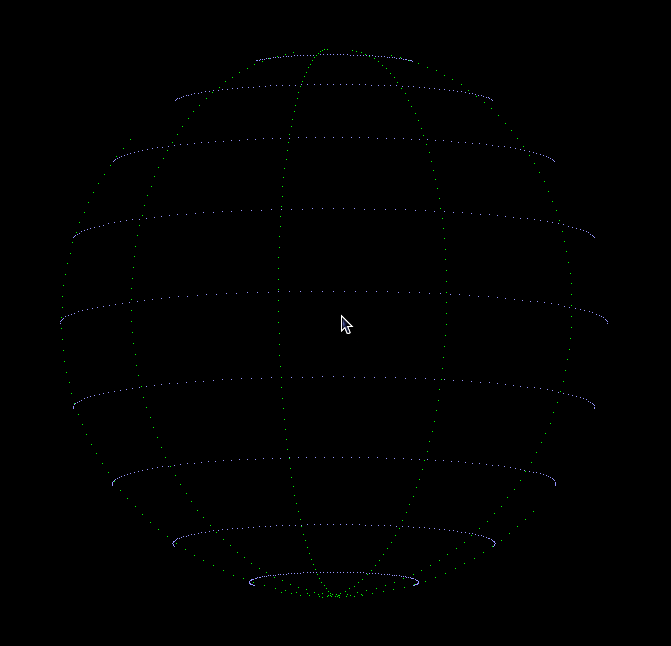

# javascript-sphere

Javascript class for drawing a sphere on an HTML5 canvas without any external dependency or library by using the Orthographic Projection Matrix technic.

# Live demo

[https://hermann-sw.github.io/javascript-sphere/](https://hermann-sw.github.io/javascript-sphere/)

# mousemove event demo

