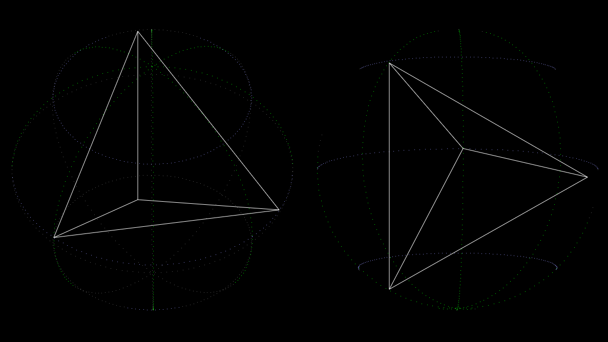

# javascript-sphere

Javascript class for drawing a sphere on an HTML5 canvas without any external dependency or library by using the Orthographic Projection Matrix technic.

# Live demo

[https://hermann-sw.github.io/javascript-sphere/](https://hermann-sw.github.io/javascript-sphere/)

# mousemove event demo

Default is "solid = false" mode left, where you see points that are not visible in case of a solid sphere. In that mode points not visible in case of a solid sphere are drawn in dark grey.  Mouse down switches to "solid = true", mouse up back to the other mode. The embedded tetrahedron (its vertices are on the sphere) is always drawn completely with white straint lines:  

